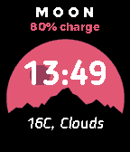
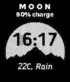
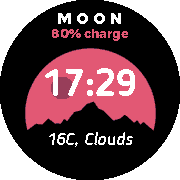
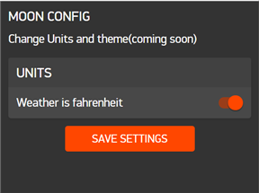
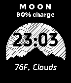
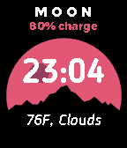
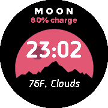

# Moon Watchface
Currently available on the pebble store.
Now with Clay config to toggle units.
Supports all pebble watches.

Pebble watchface built with C with custom fonts.
Grabs weather from openWeather.com.

**Screenshot**:
Metric

  

Config

Imperial

  

